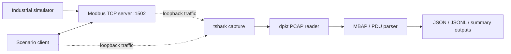

# NoBreach OT-IoT Sentinel

NoBreach is a local, simulation-first OT/IoT lab for passive industrial monitoring. It models a small Modbus TCP process plant, generates both safe and adversarial traffic patterns, captures packets on loopback, and parses them into normalized JSON events for later detection work.

This repository focuses on the first two sprints:

- Sprint 1: industrial simulation and scenario generation
- Sprint 2: PCAP capture, Modbus parsing, normalization, and summary reporting

Detection rules, dashboards, and alerting remain intentionally out of scope for this phase.

## Why this project exists

The lab is designed to be reproducible and safe to run locally:

- it never targets a remote industrial asset
- it only runs against loopback or local Docker networking
- it captures passive traffic without modifying the production process
- it produces structured event data for security and anomaly research

## Architecture



## Register map

| Address | Name | Unit | Raw encoding | Writable |
|---:|---|---|---|---|
| 0 | temperature | °C | value × 10 | dangerous_values |
| 1 | pressure | bar | value × 100 | dangerous_values |
| 2 | vibration | mm/s | value × 100 | dangerous_values |
| 3 | motor_speed | RPM | integer | no |
| 4 | production | units | integer counter | no |
| 10 | motor_command | state | 0 stopped, 1 running | yes |
| 11 | fault | state | 0 clear, 1 fault | yes |

The canonical register definitions live in [src/simulator/register_map.py](src/simulator/register_map.py).

## Features

- deterministic or seeded industrial state progression
- Modbus TCP server exposing holding registers
- normal and abnormal workload scenarios
- loopback PCAP capture with tshark
- MBAP/PDU parsing for Modbus function codes 3, 6, 16, and exceptions
- normalized JSON/JSONL event output and summary statistics
- Dockerized local lab setup for repeatable testing

## Quick start

### 1) Clone and prepare the environment

```bash
git clone <your-repo-url>
cd nobreach-ot-iot-sentinel
python -m venv .venv
# Windows PowerShell
.\.venv\Scripts\Activate.ps1
# macOS / Linux
# source .venv/bin/activate
python -m pip install -r requirements-dev.txt
cp .env.example .env
```

### 2) Start the simulator server

```bash
python -m src.simulator.server --host 127.0.0.1 --port 1502 --seed 42
```

### 3) Run a scenario

```bash
python -m src.simulator.client --scenario normal --duration 60
python -m src.simulator.client --scenario rapid_polling --duration 30 --interval 0.02
python -m src.simulator.client --scenario sensitive_write --duration 30
python -m src.simulator.client --scenario dangerous_values --duration 30
```

All scenario entry points enforce localhost-only targets.

### 4) Capture traffic on loopback

List interfaces first:

```bash
tshark -D
```

Then run a capture:

```bash
export CAPTURE_INTERFACE=lo
./scripts/capture_scenario.sh normal 30 1
./scripts/capture_scenario.sh rapid_polling 15 0.02
./scripts/capture_scenario.sh sensitive_write 15 1
./scripts/capture_scenario.sh dangerous_values 15 1
```

On Windows PowerShell, use the scripts in `scripts/` and set `$env:CAPTURE_INTERFACE` to the loopback adapter chosen by tshark.

### 5) Parse and normalize a PCAP

```bash
python -m src.parser.normalizer captures\normal\example.pcap
python -m src.parser.normalizer captures\abnormal --recursive
python -m src.parser.normalizer captures --recursive --overwrite
```

The normalizer writes:

- `results/parsed/<name>.jsonl`
- `results/parsed/<name>.json`
- `results/parsed/<name>_summary.json`

## Running tests

```bash
pytest -q
```

The test suite currently verifies:

- register encoding/decoding logic
- Modbus request/response parsing
- exception handling and malformed payload counting
- JSON normalization and summary generation

## Docker

```bash
docker compose up --build
```

Example:

```bash
SCENARIO=rapid_polling DURATION=30 docker compose up --build
```

## Repository structure

```text
.
+-- config/
+-- docs/
+-- lab/
+-- knowledge_base/
+-- scripts/
+-- src/
+-- tests/
+-- .env.example
+-- .gitignore
+-- Dockerfile
+-- README.md
+-- docker-compose.yml
+-- pytest.ini
+-- requirements.txt
+-- requirements-dev.txt
+-- ...
```

## Safety and constraints

- all traffic is local-only and loopback-based
- scenarios target localhost or Docker service addresses only
- capture and parsing logic are passive and non-invasive
- the project is an evidence-generation lab, not an active defender

## Further reading

- [docs/architecture.md](docs/architecture.md)
- [docs/scenarios.md](docs/scenarios.md)
- [docs/setup.md](docs/setup.md)
- [docs/usage.md](docs/usage.md)

## Roadmap

- Sprint 3: anomaly and threat detection rules
- Sprint 4: dashboarding, reporting, and visual analytics

## License

This project is intended for local lab use and research. Add your preferred license before publishing to a public GitHub repository.
