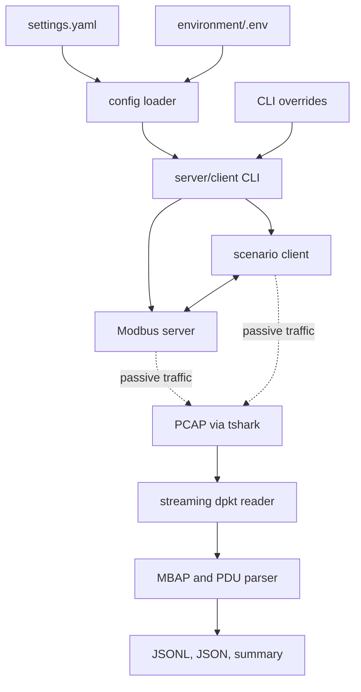

# Architecture

## Components and data flow

`IndustrialSimulator` maintains gradual, bounded physical values. The pymodbus server exposes them as holding registers on loopback port 1502. A resilient client produces normal or abnormal traffic, while tshark passively captures TCP packets. The offline `dpkt` reader streams Ethernet/IP/TCP records; the stateful parser decodes MBAP/PDU fields and correlates read responses by transaction ID. The normalizer emits schema-versioned events and a per-capture summary.

Configuration priority is built-in defaults, YAML, `.env`, environment variables, then explicit CLI arguments where provided. Register identity and scaling have one source of truth in `register_map.py`. Detection and visualization are reserved for later sprints.

The parser supports functions 3, 6, 16, and exception responses. It targets project-generated traffic; arbitrary TCP segmentation/reassembly is not implemented. Partial packets are skipped and counted instead of aborting a capture.
